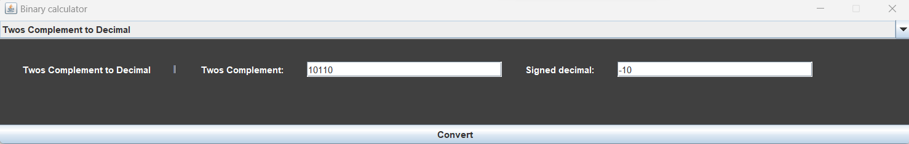

# Binary-Convertor
GUI Binary convertor in Java

## About 

This was a personal project in order to practice GUI programming with Java AWT and Swing frameworks and building applications with it, as well as explore Memoization in programming. It is an app in which users can convert between decimal, signed magnitude, unsigned binary, ones complement, twos complement and serves as a binary convertor. The GUI component consists of a JComboBox which users can pick what they want to convert between and the panel being displayed on the screen updates. Memoization, a method in which a hashmap is used to store previous calculations like a cache for the application was used in every conversion function. This was used due to the nature of conversions and how the same conversion may be repeated, by storing the data in a hashmap and checking if this conversion was calculated previously it improves time complexity in some cases. 

## Functionalities of app 

* Convert unsigned binary to decimal
* Convert unsigned decimal to unsigned binary
* Convert signed magnitude binary to decimal
* Convert decimal to signed magnitude
* Convert signed magnitude binary to ones complement 
* Convert signed magnitude binary to twos complement
* Convert decimal to ones complement
* Convert decimal to twos complement
* Convert ones complement to decimal
* Convert twos complement to decimal

## How to set up

In order to set this up you will need Java setup and this application was built in JDK 17. You will need to gather the Java class files under this repository and compile and run the code, the file to be run containing the main method is "BinaryConvertorApp.java".

[Find out how to run and compile java code here](https://www.tutorialspoint.com/How-to-run-a-java-program#:~:text=Type%20'javac%20MyFirstJavaProgram.java',result%20printed%20on%20the%20window.)

